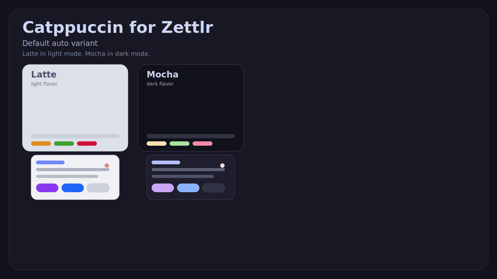
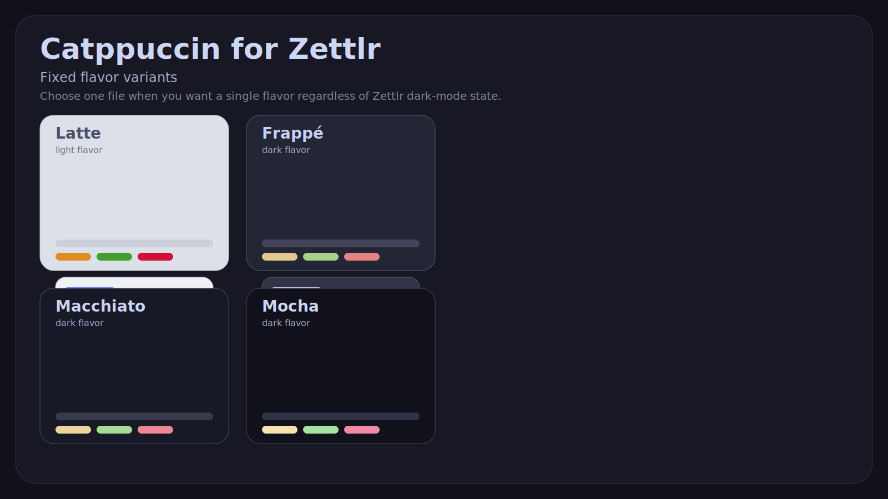

<h3 align="center">
  <br/>
  Catppuccin for Zettlr
</h3>

<p align="center">
  Soothing pastel theme for <a href="https://www.zettlr.com/">Zettlr</a>
</p>

<p align="center">
  <a href="./dist/catppuccin.css"></a>
  <a href="./themes"></a>
  <a href="./docs/feasibility.md"></a>
</p>

## Preview





## What this port is

This repository ships Catppuccin as a native Zettlr `custom.css` port. It does not patch Zettlr, does not fork the app, and does not rebuild binaries.

Technical verdict: Zettlr currently exposes two theming layers only:

- Built-in editor themes selected in Preferences (`Berlin`, `Frankfurt`, `Bielefeld`, `Karl-Marx-Stadt`, `Bordeaux`)
- A single user-level `custom.css` file loaded from the app-data directory and injected last into the renderer

There is no official importable theme-package format, no external theme registry, and no user-installable theme bundle mechanism in the current Zettlr source tree. That makes shareable Custom CSS the cleanest distributable path today. The source-backed analysis is in [`docs/feasibility.md`](./docs/feasibility.md).

## Flavors

- `dist/catppuccin.css`: default auto variant. `Latte` in light mode, `Mocha` in dark mode.
- `themes/latte.css`: fixed `Latte`, even if Zettlr itself is in dark mode.
- `themes/frappe.css`: fixed `Frappé`, even if Zettlr itself is in light mode.
- `themes/macchiato.css`: fixed `Macchiato`, even if Zettlr itself is in light mode.
- `themes/mocha.css`: fixed `Mocha`, even if Zettlr itself is in light mode.

The default auto file is the recommended install. It follows Zettlr’s `body.dark` switch and themes the full UI surface, not just the editor: app chrome, preferences, assets manager, list views, sidebars, tabs, popovers, search UI, and embedded code editors.

## Installation

### Recommended

1. Open Zettlr.
2. Open the Assets Manager.
   - macOS: `Zettlr -> Assets Manager`
   - Windows/Linux: `File -> Preferences -> Assets Manager`
   - Shortcut: `Cmd/Ctrl + Alt + ,`
3. Open the `Custom CSS` tab.
4. Paste the contents of `dist/catppuccin.css` into the editor.
5. Save.

Important: paste the CSS into `Custom CSS`, not into import/export profiles, snippets, or other asset types.

### Manual file install

Copy one of the CSS files in this repo to Zettlr’s `custom.css` path:

- macOS: `/Users/<your-user-name>/Library/Application Support/Zettlr/custom.css`
- Windows: `C:\\Users\\<your-user-name>\\AppData\\Roaming\\Zettlr\\custom.css`
- Linux: `/home/<your-user-name>/.config/Zettlr/custom.css`

## Flavor selection strategy

Zettlr only loads one `custom.css` file at a time.

- If you want automatic light/dark switching, use `dist/catppuccin.css`. It maps light mode to `Latte` and dark mode to `Mocha`.
- If you want one flavor everywhere, replace `custom.css` with one of the files from `themes/`. These are intentionally fixed-flavor exports.
- If you want a different automatic pairing, regenerate from `scripts/build.mjs`.

## Scope

This port targets the parts of Zettlr that can be styled safely through stable selectors and exposed CodeMirror token classes:

- App chrome: toolbar, tab bars, status bar, split panes
- File manager and list views
- Sidebar tabs and content lists
- Preferences, assets manager, forms, popovers, and search UI
- Editor surface and gutters, including embedded code editors outside the main writing view
- Selection, cursor, active line, search panels, tooltips, active/selected states, and focus states
- Markdown and code syntax tokens exposed by Zettlr’s CodeMirror highlighter

It intentionally avoids geometry changes. No margins, sizing, positioning, or layout structure are altered.

## Compatibility

- Researched against Zettlr source `4.3.1`
- Designed for the current `custom.css` loading model and documented body classes: `body.dark`, `body.darwin`, `body.win32`, `body.linux`
- Best effort on current stable/nightly builds, but any Zettlr release may rename selectors. When that happens, re-check with debug mode + devtools and update the generator

## Build

The generated files come from the official Catppuccin palette vendored in [`src/palette.json`](./src/palette.json).

```bash
node ./scripts/build.mjs
```

This regenerates:

- `dist/catppuccin.css`
- `themes/*.css`
- `assets/preview-auto.svg`
- `assets/preview-flavors.svg`

## Thanks to

- [Catppuccin](https://github.com/catppuccin) for the palette, style guide, and port conventions
- [Zettlr](https://github.com/Zettlr/Zettlr) for exposing a real Custom CSS entry point and CodeMirror token classes that make a lightweight port possible
